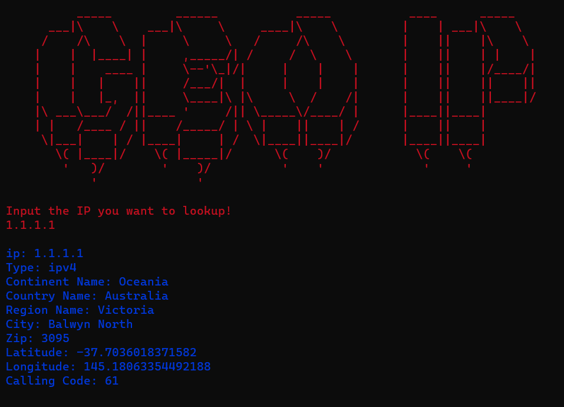

<h1>Geo IP 🌐</h1>

Get the details from any ip address!

---

<h2>How to install 🚀</h2>

1. Install `Python` and `pip`
2. Clone the repository
3. Navigate to the folder
4. Open the terminal in the folder
5. Run the `pip install -r requirements.txt` command

---

<h2>How to use 📝</h2>
1. Create a free account at <a href="https://ipstack.com/">ipstack.com</a>
2. Copy your api key
3. Open the `scanner.py` file
4. Paste your api key in the `api_access_key` variable
5. Run the `python scanner.py` command
6. Enter the ip address you want to get the details from
7. Done! 🎉

---

<h2>How to support ❤️</h2>

You can support this project by just leaving a star! ⭐

---

<h2>Known issues ⚙️</h2>

`readme.md` file is not formatted correctly on github

---

<h2>Screenshots 📷</h2>

<h2>Used libraries 🛠️</h2>

---

| **Used**                                                                       | **Version** |
|--------------------------------------------------------------------------------|-------------|
| **<a href="https://www.python.org/downloads/release/python-3113/">Python</a>** | **3.11**    |
| **<a href="https://pypi.org/project/colorama/">colorama library</a>**          | **0.4.6**   |

---

<h2>Disclaimer ⚠️</h2>
This program has not been made for any harmful purpose. I am not responsible for any damage caused by this program.
